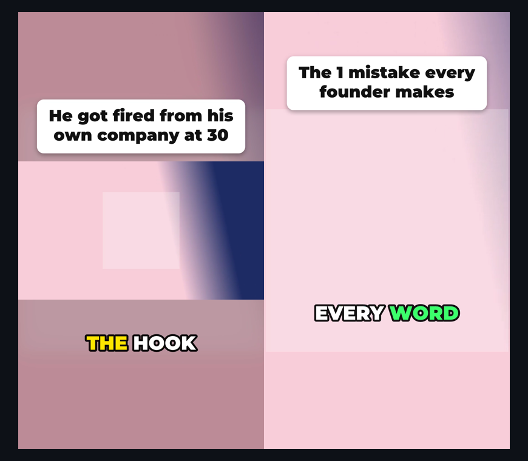

# clipswarm

[](https://github.com/Shoberman2/clipswarm/actions/workflows/ci.yml) [](https://www.npmjs.com/package/clipswarm) [](LICENSE)

**Open-source, agent-native video clipping.** Point any number of AI agents at YouTube videos *or live streams*, and get ready-to-post viral shorts back: 9:16, a hook header, and word-by-word captions. Runs on your machine, with no API keys and no subscription.

<p align="center"></p>

```
"Get me the 3 best moments from each of these 10 podcasts as shorts"
        │
        ├─ clipper agent 1 ─┐
        ├─ clipper agent 2 ─┼─► clipswarm MCP ─► yt-dlp ─► ffmpeg ─► clips/*_viral.mp4
        └─ clipper agent N ─┘     shared queue, cached transcripts, retries
```

## Why clipswarm

OpusClip-style apps decide for you what's "viral". clipswarm gives **your agent** the tools to decide, then does the production work:

- **Viral format built in**: 1080×1920, a hook header card, the video on a blurred backdrop (or a full-bleed crop), and animated captions that highlight each word as it's spoken.
- **YouTube videos *and* live streams**: clip what just happened on a live stream (`start: -60, end: "now"`), or what aired at 8:41pm.
- **Captions from real word timings**: YouTube's auto-captions for regular videos, and local [whisper.cpp](https://github.com/ggml-org/whisper.cpp) for live streams. Free and offline.
- **Built for swarms**: dozens of parallel jobs across many videos and many simultaneous agents, all through one shared queue. Transcripts are fetched once per video, and one bad job never sinks a batch.
- **Fast and frugal**: downloads only the seconds you clip (not the whole 3-hour stream), and uses hardware encoding on macOS.
- **Works with any ffmpeg**: text is rendered by clipswarm itself, so stock builds without `drawtext`/`libass` (e.g. Homebrew's) work fine.

## Install

**1. Dependencies** (Node 20+):

```bash
brew install yt-dlp ffmpeg whisper-cpp     # macOS
# Linux: pip install -U yt-dlp && sudo apt install ffmpeg   (+ whisper.cpp for live captions)
npx -y clipswarm setup                     # checks everything; downloads the caption model (~140MB)
```

`whisper-cpp` is optional. Without it, everything works, but live-stream clips render without captions.

> Keep yt-dlp up to date (`yt-dlp -U` / `brew upgrade yt-dlp`). YouTube regularly breaks older versions. This is the #1 cause of failures.

**2. Add it to your AI app:**

| App | How |
|---|---|
| **Claude Code** (recommended, includes the `clipper` agent) | `/plugin marketplace add Shoberman2/clipswarm` then `/plugin install clipswarm@clipswarm` |
| Claude Code (MCP only) | `claude mcp add clipswarm -- npx -y clipswarm mcp --out ./clips` |
| **Claude Desktop** | Settings → Developer → Edit Config, add the JSON below |
| **ChatGPT desktop app / Codex** | `codex mcp add clipswarm -- npx -y clipswarm mcp` (shared by Codex CLI, the IDE extension and the ChatGPT desktop app) |
| Cursor | `~/.cursor/mcp.json`, JSON below |
| VS Code | `code --add-mcp '{"name":"clipswarm","command":"npx","args":["-y","clipswarm","mcp"]}'` |
| Gemini CLI | `gemini mcp add clipswarm npx -y clipswarm mcp` |

```json
{ "mcpServers": { "clipswarm": { "command": "npx", "args": ["-y", "clipswarm", "mcp", "--out", "/Users/you/clips"] } } }
```

> **Why not claude.ai or ChatGPT on the web?** Those only connect to *hosted* servers. Hosting a YouTube downloader means datacenter IP blocks, Terms of Service exposure, and shipping 50MB videos through a chat window. clipswarm runs locally, where all three problems disappear.

## Use it

In Claude Code with the plugin installed:

> Spawn a clipper agent for each of these videos in parallel and get me the 3 strongest moments from each as viral shorts: <url1> <url2> <url3>

> Clip the last 60 seconds of https://www.youtube.com/@aljazeeraenglish/live as a viral short.

Each `clipper` agent reads its video's transcript, picks self-contained moments, writes a hook for each, and calls `create_clips`. They all run at once.

## The viral format

| Option | Default | |
|---|---|---|
| `style` | `"plain"` | `"viral"` for the 9:16 format |
| `title` | video title | The header hook. Agents should write a punchy one (≤10 words); `""` for no header |
| `layout` | `"fit"` | `"fit"`: whole frame on a blurred backdrop, header above, captions below. `"fill"`: crop to 9:16 (best for one centred speaker) |
| `captions` | `true` | Word-by-word captions, 1–3 words at a time, current word highlighted |
| `accent` | `"#FFE600"` | Highlight colour |

Captions come from YouTube's auto-captions (exact per-word timing) for regular videos, and from local whisper.cpp for live streams or videos without captions. If neither is available, the clip still renders and the result includes a `warnings` entry explaining why.

## Live streams

Paste a link to a stream that's live right now (a `watch?v=` or a channel's `/live` link). Times are relative to the live edge:

| You want | `start` | `end` |
|---|---|---|
| The last 30 seconds | `-30` | `"now"` |
| 2 minutes ago, 20s long | `"-2:00"` | `"-1:40"` |
| What aired at a specific moment | `"2026-10-08T00:51:00Z"` | `"2026-10-08T00:51:30Z"` |

- About the **last hour** is available (YouTube's DVR window).
- Plain live clips are stream-copied for speed and start on the previous keyframe (≤5s early). `live.from` / `live.to` in the result give the exact wall-clock range. Use `precise: true` for frame-accurate cuts. Viral clips are always frame-accurate.
- `end` can't be in the future. Retry once it has aired.

## How it works

1. **Find the moment.** The agent calls `get_video_info`, `search_transcript` and `get_transcript`. Transcripts come from YouTube's captions via yt-dlp and are cached.
2. **Cut it.**
   - **Regular videos:** yt-dlp downloads only the requested section.
   - **Live streams:** clipswarm reads YouTube's rolling HLS playlist (5-second segments with wall-clock stamps) and fetches just the segments covering your range.
3. **Make it viral.** clipswarm gets word timings and draws the header and caption frames (font → vector paths → PNG). ffmpeg composites them over the video on a blurred 9:16 canvas.
4. **Share the machine.** Every job from every agent goes through one concurrency limiter, with retries for YouTube's intermittent 403s.

Contributors: see [docs/ARCHITECTURE.md](docs/ARCHITECTURE.md) for a full walkthrough of the code.

## MCP tools

| Tool | What it does |
|---|---|
| `get_video_info` | Title, channel, duration, chapters, `liveStatus` |
| `get_transcript` | Timestamped transcript as compact `[m:ss] text` lines, optionally windowed with `from`/`to` |
| `search_transcript` | Where a phrase is said, as padded time windows ready to clip |
| `create_clips` | Cuts many clips in parallel across any number of videos, live or not. Options: `style`, `title`, `layout`, `captions`, `accent`, `label`, `vertical`, `maxHeight`, `precise` |

## CLI

```bash
clipswarm clip <url> 13:53 14:28 --viral --title "His best advice in 30 seconds"
clipswarm clip <live-url> -60 now --viral --title "This just happened live"
clipswarm clip <url> 1:23 1:58 --label raw-cut                    # plain clip
clipswarm batch jobs.json --out clips                             # many jobs at once, writes clips/manifest.json
clipswarm search <url> stay hungry
clipswarm transcript <url>
clipswarm setup
```

## Configuration

| Env var | Default | |
|---|---|---|
| `CLIPSWARM_CONCURRENCY` | `min(6, cpus)` | Max simultaneous download/encode jobs, shared across all callers |
| `CLIPSWARM_MAX_CLIP_SEC` | `600` | Guards against accidentally downloading whole videos |
| `CLIPSWARM_RETRIES` | `3` | Retries for transient YouTube errors |
| `CLIPSWARM_WHISPER_MODEL` | `~/.cache/clipswarm/ggml-base.en.bin` | Any whisper.cpp model, e.g. a multilingual one |
| `CLIPSWARM_FONT` | bundled Montserrat Black | Any TTF/OTF for headers and captions |

## Responsible use

Only clip content you have the rights to use: your own videos, content you've licensed, or uses covered by fair use in your jurisdiction. Downloading may be restricted by YouTube's Terms of Service. You are responsible for how you use this tool.

## Roadmap (help wanted)

Driven by what users ask for. Open an issue.

- [ ] Face-tracked crop for `layout: "fill"`
- [ ] More caption styles (karaoke boxes, emoji, per-word pop)
- [ ] Local files and other platforms (most yt-dlp sites already work)
- [ ] Optional hosted mode / HTTP transport for remote agents

## License

MIT. The bundled Montserrat font is under the [SIL Open Font License](assets/fonts/OFL.txt). See [CONTRIBUTING.md](CONTRIBUTING.md) to help out.
